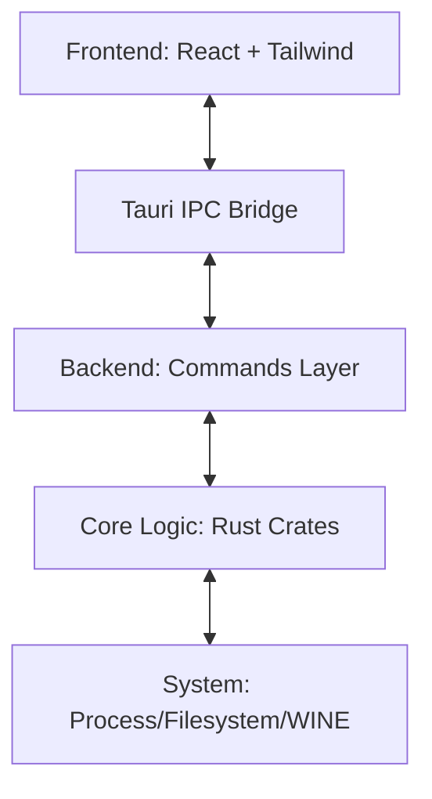

# YAGO Project Structure & Architecture

This document provides a comprehensive map of the YAGO codebase. It is designed to help any human or AI agent navigate the project without prior knowledge.

---

## 🏗 High-Level Architecture

YAGO is built as a **Tauri** application, which creates a bridge between a React-based frontend and a modular Rust-based backend.

---

## 🖥 Frontend (`src-ui/src/`)

The frontend follows a strictly modular React architecture focused on performance and scalability.

### 📂 `src-ui/src/components/`
*   **`dashboard/`**: Orchestrates the main view (Layout, Header, Overview).
*   **`mod-manager/`**: Complex logic for mod lifecycle management.
    *   `inspector/`: Decomposed into `Info`, `Files` (File Manager), and `Editor` (Mini-IDE).
*   **`settings/`**: Modular forms for game and profile configuration.
*   **`ui/`**: Reusable atomic components and global dialogs.

### 📂 `src-ui/src/store/`
*   **`gameStore.ts`**: The "Brain" of the frontend. Uses **Zustand** to manage library and process state.
*   **`uiStore.ts`**: Manages global UI states like alerts and prompts.

### 📂 `src-ui/src/types/`
*   **`index.ts`**: Centralized TypeScript interfaces for the entire frontend.
*   **`backend.d.ts`**: Typings for backend-specific models.

---

## 🦀 Backend & Logic Layer

The backend is composed of a thin Tauri host and a collection of domain-specific Rust crates.

### 📂 `src-tauri/src/`
*   **`commands/`**: Modular IPC command handlers (`library.rs`, `mods.rs`, `launcher.rs`, etc.).
*   **`config.rs`**: Handles persistent application configuration.

### 📂 `crates/` (The Engine Room)
Independent crates, each with their own `tests/` directory.

| Crate | Responsibility |
| :--- | :--- |
| **`fs_engine`** | VFS, Archive extraction, Atomic file operations. |
| **`librarian`** | The Inventory: Manages decentralized game DBs, **granular path overrides**, and the `TemplateRegistry`. |
| **`proc_marshal`** | Process execution, FPS Unlocking, Sandbox snapshots. |

#### 📂 Librarian Storage Architecture
*   **`LibrarianConfig`**: Orchestrates base storage and individual path overrides for Mods, Runners, and Prefixes.
*   **`GamePaths`**: Provides standardized path resolution for per-game resources.
*   **`scanner`**: Performs deep recursive identification of supported titles.
*   **`discovery`**: Implements fuzzy template matching to link manual installations to official Sophon metadata.

#### 📦 Sophon Engine Sub-modules
*   **`protocol`**: Binary manifest parser for Zstd+Protobuf Sophon files. Maps unified HoYoPlay identifiers to regional manifests.
*   **`orchestrator`**: MPMC worker pool managing parallel block downloads and **Smart Incremental Repairs**.
*   **`client`**: HoYoPlay API client for `getBuild` discovery and raw chunk fetching.
*   **`patcher`**: Safe FFI wrapper for `HDiffZ` for high-performance delta-patching.
*   **`journal`**: Crash-resilient tracker for chunk-level progress (Pending/Applied/Verified).

---

## 🛠 Shared Resources & Scripts

*   **`resources/`**: Bundled data (Embedded via `include_dir` in the binary).
    *   `templates/`: JSON definitions for supported games.
    *   `hashes.json`: Character vertex buffer hash database.
    *   `app_config.json`: Default application URLs and presets.
*   **`scripts/`**: Development and environment utilities.
    *   `setup.sh`: Automated environment initialization.
    *   `sync-env.js`: Node-based environment synchronization.
*   **`fixtures/`**: Standardized mock data and assets for integration testing.

---

## 🔄 Common Data Flows

### **Environment Synchronization**
1.  Project uses a single **`.env`** in the root.
2.  `scripts/sync-env.js` ensures `tauri.conf.json` matches the dev port.
3.  Vite loads the root `.env` directly from the parent directory.

### **Asset Extraction**
1.  On first run, the Rust backend extracts the bundled `resources/` into the user's `app_data` directory.
2.  The `yago-asset://` protocol provides secure, high-performance access to these files.