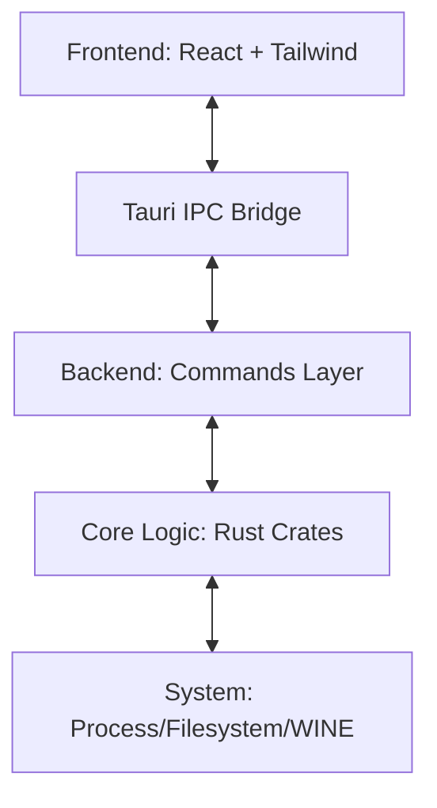

# YAGO Project Structure & Architecture

This document provides a comprehensive map of the YAGO codebase. It is designed to help any human or AI agent navigate the project without prior knowledge.

---

## 🏗 High-Level Architecture

YAGO is built as a **Tauri** application, which creates a bridge between a React-based frontend and a modular Rust-based backend.

---

## 🖥 Frontend (`src-ui/src/`)

The frontend follows a strictly modular React architecture focused on performance and scalability.

### 📂 `src-ui/src/components/`
*   **`dashboard/`**: Orchestrates the main view.
    *   `AppLayout.tsx`: The shell, navigation, and dynamic background.
    *   `GameHeader.tsx`: Context-aware controls (Profiles, Stream Safety).
    *   `GameOverview.tsx`: The primary "Hero" view for the selected game.
*   **`mod-manager/`**: Complex logic for mod lifecycle management.
    *   `inspector/`: Decomposed into `ModInspectorInfo`, `Files` (File Manager), and `Editor` (Mini-IDE).
    *   `ModItems.tsx`: Efficient rendering for List, Grid, and Compact views.
*   **`settings/`**: Modular forms for game configuration.
    *   `GeneralSettings`, `InstallationSettings`, `AdvancedSettings`.
*   **`ui/`**: Reusable atomic components (Buttons, Modals, Dialogs).

### 📂 `src-ui/src/store/`
*   **`gameStore.ts`**: The "Brain" of the frontend. Uses **Zustand** to manage game library, download status, and process state. Maps backend `snake_case` models to frontend `camelCase`.
*   **`uiStore.ts`**: Manages global modal states, alerts, and interaction prompts.

### 📂 `src-ui/src/lib/`
*   **`api.ts`**: The IPC mapping layer. Every function here corresponds to a `#[tauri::command]` in the backend.

---

## 🦀 Backend & Logic Layer

The backend is composed of a thin Tauri wrapper and a collection of domain-specific Rust crates.

### 📂 `src-tauri/src/` (The Application Host)
*   **`lib.rs`**: Entry point. Sets up the Tauri builder, state management (`AppState`), and security protocols (`yago-asset://`).
*   **`commands/`**: Modular IPC command handlers.
    *   `library.rs`, `mods.rs`, `launcher.rs`, `setup.rs`, etc.
*   **`config.rs`**: Handles persistent application-level configuration (`assets/app_config.json`).

### 📂 `crates/` (The Engine Room)
Each crate is independent and testable via its own `tests/` directory.

| Crate | Responsibility |
| :--- | :--- |
| **`fs_engine`** | VFS (Symlinks), Archive extraction, Atomic file operations, Transcoding. |
| **`librarian`** | Database management, Mod metadata parsing, Game discovery, Character roster queries. |
| **`proc_marshal`** | Process execution, Environment variable injection (WINEDLLOVERRIDES), Memory patching (FPS Unlock), Sandbox snapshots. |
| **`logic_weaver`** | Deployment planning, INI merging, Path rewriting, Shader (DXBC) patching. |
| **`ini_forge`** | Custom INI parser/compiler with support for logic commands (`if`, `endif`). |
| **`loader_ctl`** | Management of 3DMigoto/GIMI/ReShade installation and proxy chaining. |
| **`quartermaster`** | Asset caching and GitHub release resolution (Proton/Loader updates). |
| **`sophon_engine`** | Delta update protocol and MD5 checksum verification. |

---

## 🧪 Testing Strategy

The project employs a three-tier testing strategy:

1.  **Crate Unit Tests**: Located in `crates/<name>/tests/`. Run via `cargo test -p <name>`.
2.  **Integration Flows**: Located in `crates/integration_tests/src/flows/`. Validates multi-crate workflows (e.g., Import -> Deploy -> Launch).
3.  **Simulation Environment**: Located in `crates/integration_tests/src/simulation/`. Runs end-to-end "User Stories" against a mock filesystem.

---

## 🛠 Project Root & Metadata

*   **`assets/`**: Centralized config, character hash databases, and game templates.
*   **`build_tools/`**: Cross-platform release scripts (Flatpak, AppImage, DEB, RPM, Windows).
*   **`Makefile`**: The canonical way to interact with the project.
    *   `make dev`: Start dev environment.
    *   `make test`: Run all workspace tests.
    *   `make build`: Full production build.

---

## 🔄 Common Data Flows

### **Mod Deployment Flow**
1.  Frontend calls `deploy_mods` via IPC.
2.  `logic_weaver` generates a `DeploymentPlan` (symlink map + generated merged INIs).
3.  `fs_engine` wipes the `Mods/YAGO` folder and executes the plan using atomic operations.

### **Game Launch Flow**
1.  `launcher.rs` gathers config from `AppState`.
2.  `loader_ctl` ensures proxy DLLs (d3d11.dll/dxgi.dll) are in place.
3.  `proc_marshal` builds the command (Native/Wine/Proton) and handles the process lifecycle.
